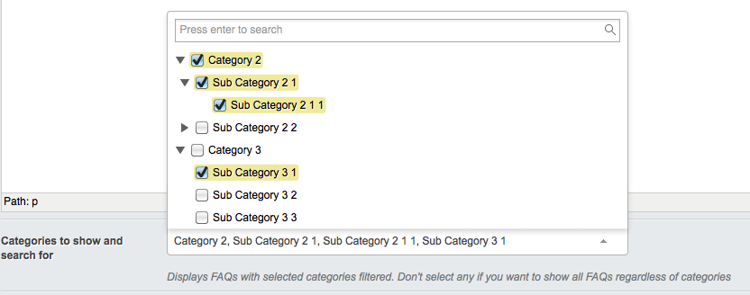

# FAQ

## Maintainers

 * Wilfred Godfrey (wjagodfrey)
 * Denise Rivera (d-rivera-c)
 * Ben Manu (benmanu)

## Introduction

This module provides FAQ functionality on top of Solr.

## Requirements

 * Fulltextsearch module, v2.1.0 or up.
 
### Using CWP

If your using the module with CWP, extra requirements should be noticed (even if not required on composer for this project)

 * CWP 1.1.1
 * CWP-core 1.1.2

## Installation

### Composer

Edit your project-wide composer.json file as follows; in the "require" block add:

    "silverstripe/faq": "*"

Then in the root of your project run:

    #> composer update silverstripe/faq

### Web

To begin the installation first download the module online. Download the module as a zip file from the github page.

After you have finished downloading the file, extract the downloaded file to your site's root
folder and ensure the name of the module is `faq`.

### Configuring Solr
The module assumes you already have Solr installed and configured. If using CWP, then it will be configured for you.
We assume that if you are using this module, you already have Solr configured an running, but if you need help getting started with configuration,
here is some starting code for configuring Solr

````
/**
 * Configure Solr.
 */
if(!class_exists('Solr')) return;

// get options from configuration
$options = Config::inst()->get('CwpSolr', 'options');
$solrOptions = array(
			'host' => defined('SOLR_SERVER') ? SOLR_SERVER : 'localhost',
			'port' => defined('SOLR_PORT') ? SOLR_PORT : 8983,
			'path' => defined('SOLR_PATH') ? SOLR_PATH : '/solr/',
			'version' => 4,

			'indexstore' => array(
				'mode' => defined('SOLR_MODE') ? SOLR_MODE : 'file',
				'auth' => defined('SOLR_AUTH') ? SOLR_AUTH : NULL,

				// Allow storing the solr index and config data in an arbitrary location,
				// e.g. outside of the webroot
				'path' => defined('SOLR_INDEXSTORE_PATH') ? SOLR_INDEXSTORE_PATH : BASE_PATH . '/.solr',
				'remotepath' => defined('SOLR_REMOTE_PATH') ? SOLR_REMOTE_PATH : null
			)
		);

Solr::configure_server($solrOptions);
````


This code would go on `mysite/_config.php`.

### All

Run a database rebuild by visiting *http://yoursite.com/dev/build*. This will add the required database
columns and tables for the module to function.

## What does it do

Just by adding the module to one project, you'll get a ModelAdmin for FAQs, where you can manage Questions & Answers.
You only need to add an FAQPage type (comes with the module), and some questions and answers. Oh, an remember
to do `Solr_Configure` and `Solr_ReIndex`.

The module comes with its own Solr search index, customized to have a fuzzy search, and has its own file for stopwords and synonyms.


## Quickstart

1. Add a FAQPage to your CMS

    

2. Add an FAQ on the FAQ ModelAdmin sidebar link

    

3. Wait for Solr to reindex
4. Search your FAQ page :)

    

## Configuration

### Frontend templates

All templates can be overloaded from within your project themes directory. Module default templates can be found in the module's `templates` directory.

### Configuration using YAML

FAQ module comes with a default set of templates to start the Solr index. If you want to override the path from where this files
come from, you need to add a YAML file like this.
```
---
Name: faqoverride
After: 'faq/*'
---
FAQSearchIndex:
  options:
    extraspath: 'new/path/to/extrapath'
    templatespath: 'new/path/to/template'
	
FAQ:
  question_boost: '3'
  answer_boost: '1'
  keywords_boost: '4'
```
### Adding Featured FAQs

Featured FAQs appear on the FAQ Page before a user performs a search. These can be added and organised from the `Featured FAQs` tab of the FAQ Page CMS admin.


### Categorizing

The FAQ module gives the option to categorize each FAQ and filter the results fetched on search. You only need to
create some Taxonomies for the categories and assign categories to the FAQs. Then filter them in the FAQPage.



This way the FAQPage will show a dropdown on the frontend to filter by categories.
If the FAQPage doesn't have any category selected, it will display all FAQs.


## TODO

- Get static config variables from yml files for controller
- Pagetypes, search index and dataobjects easily extendable
